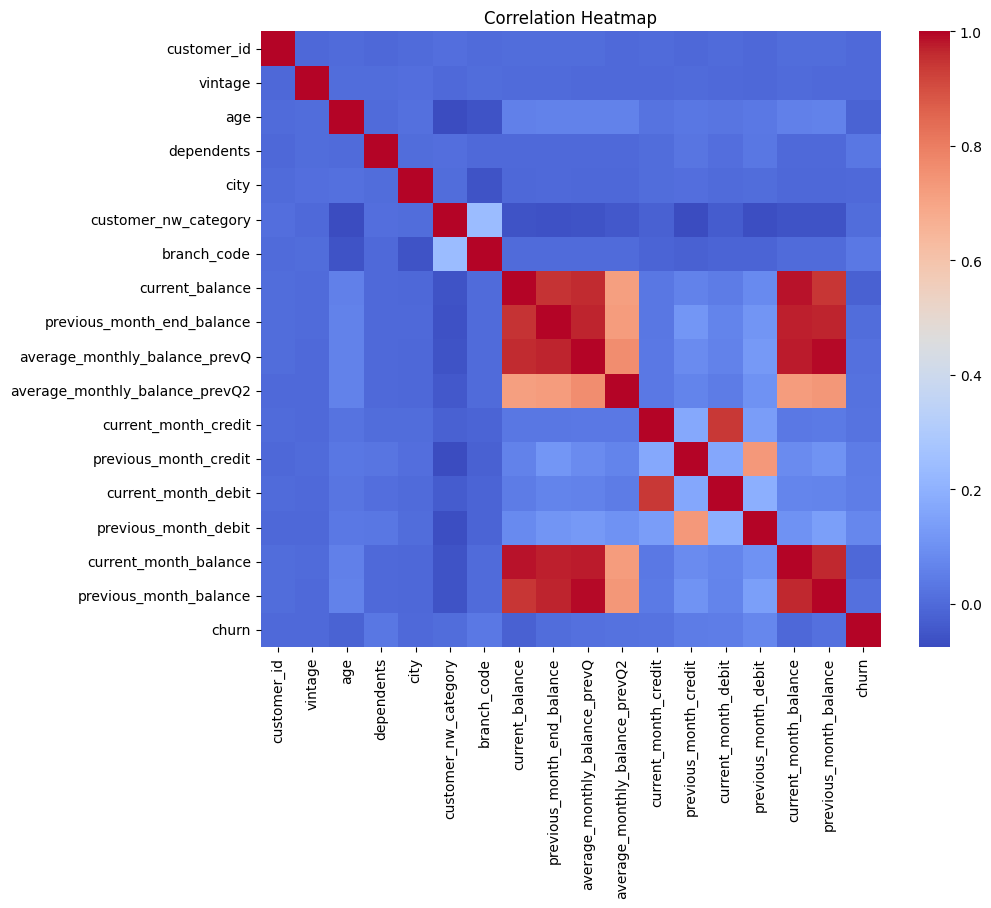
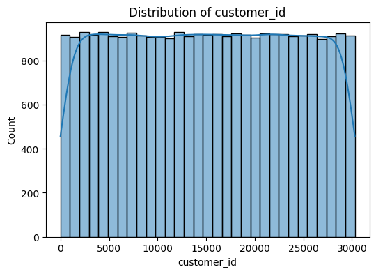
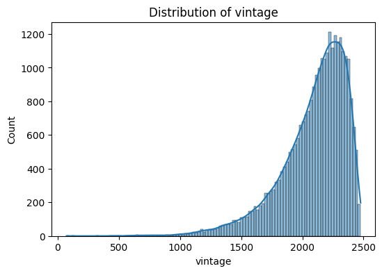
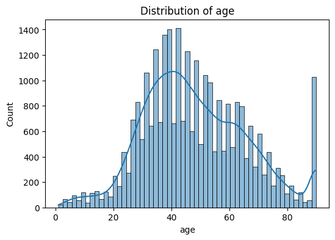
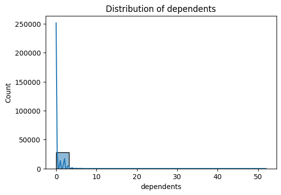
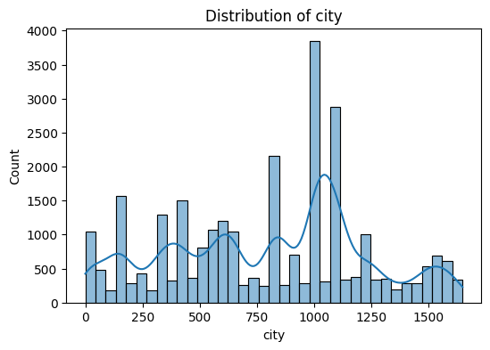
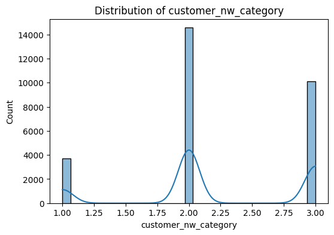

# Churn Prediction Dataset – Exploratory Data Analysis

## 1. Introduction

This report documents data preparation and exploratory data analysis (EDA) for **churn_prediction.csv**.

## 2. Data Overview

* Shape after loading: **28382 rows × 21 columns**
* Shape after duplicate removal: **28382 rows × 21 columns**

### Schema

```
customer_id                         int64
vintage                             int64
age                                 int64
gender                             object
dependents                        float64
occupation                         object
city                              float64
customer_nw_category                int64
branch_code                         int64
current_balance                   float64
previous_month_end_balance        float64
average_monthly_balance_prevQ     float64
average_monthly_balance_prevQ2    float64
current_month_credit              float64
previous_month_credit             float64
current_month_debit               float64
previous_month_debit              float64
current_month_balance             float64
previous_month_balance            float64
churn                               int64
last_transaction                   object
```

### Sample (first 10 rows)

|   customer_id |   vintage |   age | gender   |   dependents | occupation    |   city |   customer_nw_category |   branch_code |   current_balance |   previous_month_end_balance |   average_monthly_balance_prevQ |   average_monthly_balance_prevQ2 |   current_month_credit |   previous_month_credit |   current_month_debit |   previous_month_debit |   current_month_balance |   previous_month_balance |   churn | last_transaction   |
|--------------:|----------:|------:|:---------|-------------:|:--------------|-------:|-----------------------:|--------------:|------------------:|-----------------------------:|--------------------------------:|---------------------------------:|-----------------------:|------------------------:|----------------------:|-----------------------:|------------------------:|-------------------------:|--------:|:-------------------|
|             1 |      2101 |    66 | Male     |            0 | self_employed |    187 |                      2 |           755 |           1458.71 |                      1458.71 |                         1458.71 |                          1449.07 |                   0.2  |                    0.2  |                  0.2  |                   0.2  |                 1458.71 |                  1458.71 |       0 | 2019-05-21         |
|             2 |      2348 |    35 | Male     |            0 | self_employed |    834 |                      2 |          3214 |           5390.37 |                      8704.66 |                         7799.26 |                         12419.4  |                   0.56 |                    0.56 |               5486.27 |                 100.56 |                 6496.78 |                  8787.61 |       0 | 2019-11-01         |
|             4 |      2194 |    31 | Male     |            0 | salaried      |    146 |                      2 |            41 |           3913.16 |                      5815.29 |                         4910.17 |                          2815.94 |                   0.61 |                    0.61 |               6046.73 |                 259.23 |                 5006.28 |                  5070.14 |       0 | NaT                |
|             5 |      2329 |    90 | Male     |            0 | self_employed |   1020 |                      2 |           582 |           2291.91 |                      2291.91 |                         2084.54 |                          1006.54 |                   0.47 |                    0.47 |                  0.47 |                2143.33 |                 2291.91 |                  1669.79 |       1 | 2019-08-06         |
|             6 |      1579 |    42 | Male     |            2 | self_employed |   1494 |                      3 |           388 |            927.72 |                      1401.72 |                         1643.31 |                          1871.12 |                   0.33 |                  714.61 |                588.62 |                1538.06 |                 1157.15 |                  1677.16 |       1 | 2019-11-03         |
|             7 |      1923 |    42 | Female   |            0 | self_employed |   1096 |                      2 |          1666 |          15202.2  |                     16059.3  |                        15211.3  |                         13798.8  |                   0.36 |                    0.36 |                857.5  |                 286.07 |                15719.4  |                 15349.8  |       0 | 2019-11-01         |
|             8 |      2048 |    72 | Male     |            0 | retired       |   1020 |                      1 |             1 |           7006.93 |                      7714.19 |                         7859.74 |                         11232.4  |                   0.64 |                    0.64 |               1299.64 |                 439.26 |                 7076.06 |                  7755.98 |       0 | 2019-09-24         |
|             9 |      2009 |    46 | Male     |            0 | self_employed |    623 |                      2 |           317 |          10096.6  |                      8519.53 |                         6511.82 |                         16314.2  |                   0.27 |                    0.27 |                443.13 |                5688.44 |                 8563.84 |                  5317.04 |       0 | 2019-07-12         |
|            10 |      2053 |    31 | Male     |            0 | salaried      |   1096 |                      2 |          4110 |           1355.86 |                      1355.86 |                         1702.44 |                          1126.13 |                 714.51 |                  121.09 |                714.51 |                 359.44 |                 1183.45 |                  1857.42 |       0 | 2019-12-12         |
|            11 |      2295 |    40 | Male     |            3 | self_employed |   1020 |                      2 |            38 |           4957.95 |                      4244.38 |                         2168.53 |                          1864.33 |                6912.29 |                 4206.13 |               1887.3  |                1348.85 |                 1823.16 |                  2416.69 |       0 | 2019-12-31         |


## 3. Missing Value Analysis

### Before Imputation

```
customer_id                          0
vintage                              0
age                                  0
gender                             525
dependents                        2463
occupation                          80
city                               803
customer_nw_category                 0
branch_code                          0
current_balance                      0
previous_month_end_balance           0
average_monthly_balance_prevQ        0
average_monthly_balance_prevQ2       0
current_month_credit                 0
previous_month_credit                0
current_month_debit                  0
previous_month_debit                 0
current_month_balance                0
previous_month_balance               0
churn                                0
last_transaction                     0
```

### After Imputation

```
customer_id                       0
vintage                           0
age                               0
gender                            0
dependents                        0
occupation                        0
city                              0
customer_nw_category              0
branch_code                       0
current_balance                   0
previous_month_end_balance        0
average_monthly_balance_prevQ     0
average_monthly_balance_prevQ2    0
current_month_credit              0
previous_month_credit             0
current_month_debit               0
previous_month_debit              0
current_month_balance             0
previous_month_balance            0
churn                             0
last_transaction                  0
```

## 4. Descriptive Statistics (Numeric Features)

|                                |   count |         mean |          std |       min |     25% |      50% |       75% |             max |
|:-------------------------------|--------:|-------------:|-------------:|----------:|--------:|---------:|----------:|----------------:|
| customer_id                    |   28382 | 15143.5      |  8746.45     |      1    | 7557.25 | 15150.5  | 22706.8   | 30301           |
| vintage                        |   28382 |  2091.14     |   272.677    |     73    | 1958    |  2154    |  2292     |  2476           |
| age                            |   28382 |    48.2083   |    17.8072   |      1    |   36    |    46    |    60     |    90           |
| dependents                     |   28382 |     0.317102 |     0.958386 |      0    |    0    |     0    |     0     |    52           |
| city                           |   28382 |   797.182    |   426.751    |      0    |  409    |   834    |  1096     |  1649           |
| customer_nw_category           |   28382 |     2.22553  |     0.660443 |      1    |    2    |     2    |     3     |     3           |
| branch_code                    |   28382 |   925.975    |   937.799    |      1    |  176    |   572    |  1440     |  4782           |
| current_balance                |   28382 |  7380.55     | 42598.7      |  -5503.96 | 1784.47 |  3281.26 |  6635.82  |     5.9059e+06  |
| previous_month_end_balance     |   28382 |  7495.77     | 42529.3      |  -3149.57 | 1906    |  3379.91 |  6656.53  |     5.74044e+06 |
| average_monthly_balance_prevQ  |   28382 |  7496.78     | 41726.2      |   1428.69 | 2180.95 |  3542.86 |  6666.89  |     5.70029e+06 |
| average_monthly_balance_prevQ2 |   28382 |  7124.21     | 44575.8      | -16506.1  | 1832.51 |  3359.6  |  6517.96  |     5.01017e+06 |
| current_month_credit           |   28382 |  3433.25     | 77071.5      |      0.01 |    0.31 |     0.61 |   707.272 |     1.22698e+07 |
| previous_month_credit          |   28382 |  3261.69     | 29688.9      |      0.01 |    0.33 |     0.63 |   749.235 |     2.36181e+06 |
| current_month_debit            |   28382 |  3658.74     | 51985.4      |      0.01 |    0.41 |    91.93 |  1360.43  |     7.63786e+06 |
| previous_month_debit           |   28382 |  3339.76     | 24301.1      |      0.01 |    0.41 |   109.96 |  1357.55  |     1.41417e+06 |
| current_month_balance          |   28382 |  7451.13     | 42033.9      |  -3374.18 | 1996.76 |  3447.99 |  6667.96  |     5.77818e+06 |
| previous_month_balance         |   28382 |  7495.18     | 42432        |  -5171.92 | 2074.41 |  3465.23 |  6654.69  |     5.72014e+06 |
| churn                          |   28382 |     0.185329 |     0.388571 |      0    |    0    |     0    |     0     |     1           |


## 5. Categorical Feature Frequencies (Top 10)

### gender
| gender   |   count |
|:---------|--------:|
| Male     |   17073 |
| Female   |   11309 |


### occupation
| occupation    |   count |
|:--------------|--------:|
| self_employed |   17556 |
| salaried      |    6704 |
| student       |    2058 |
| retired       |    2024 |
| company       |      40 |


### last_transaction
| last_transaction   |   count |
|:-------------------|--------:|
| NaT                |    3223 |
| 2019-12-31         |    1672 |
| 2019-12-28         |     831 |
| 2019-12-17         |     654 |
| 2019-12-27         |     632 |
| 2019-12-25         |     596 |
| 2019-12-26         |     576 |
| 2019-12-24         |     561 |
| 2019-12-20         |     486 |
| 2019-12-18         |     478 |


## 7. Correlation Analysis



## 8. Feature Distributions

### customer_id



### vintage



### age



### dependents



### city



### customer_nw_category



## 9. Key Insights & Next Steps


- The dataset contains **28382** rows after cleaning.
- Missing values were handled via median (numeric) and mode (categorical) imputation.
- Correlation analysis revealed potential multicollinearity between some numeric features (see heatmap).
- The target variable 'Churn' is balanced (see distribution); this may necessitate handling class imbalance for predictive modeling.
- Next steps could include feature engineering, model selection, and cross-validation.
