# Churn Prediction – Data Preparation & EDA Report  

**Source file:** `./data/churn_prediction.csv`  
**Rows, Columns (original):** (28382, 21)  
**Rows, Columns (after cleaning):** (28382, 21)  
**Duplicates removed:** 0  
**Missing values after cleaning:** 0  

## 1. Column Overview
| Column | Dtype | #Unique | #Missing (before) |
|--------|-------|---------|-------------------|
| customer_id | object | 28382 | 0 |
| vintage | object | 1459 | 0 |
| age | object | 90 | 0 |
| gender | object | 2 | 525 |
| dependents | object | 15 | 2463 |
| occupation | object | 5 | 80 |
| city | object | 1604 | 803 |
| customer_nw_category | object | 3 | 0 |
| branch_code | object | 3185 | 0 |
| current_balance | object | 27903 | 0 |
| previous_month_end_balance | object | 27922 | 0 |
| average_monthly_balance_prevQ | object | 27801 | 0 |
| average_monthly_balance_prevQ2 | object | 27940 | 0 |
| current_month_credit | object | 10411 | 0 |
| previous_month_credit | object | 10711 | 0 |
| current_month_debit | object | 13704 | 0 |
| previous_month_debit | object | 14010 | 0 |
| current_month_balance | object | 27944 | 0 |
| previous_month_balance | object | 27913 | 0 |
| churn | object | 2 | 0 |
| last_transaction | object | 361 | 0 |

## 2. Descriptive Statistics  
|        |   customer_id |   vintage |        age | gender   |   dependents | occupation    |      city |   customer_nw_category |   branch_code |   current_balance |   previous_month_end_balance |   average_monthly_balance_prevQ |   average_monthly_balance_prevQ2 |   current_month_credit |   previous_month_credit |   current_month_debit |   previous_month_debit |   current_month_balance |   previous_month_balance |        churn | last_transaction   |
|:-------|--------------:|----------:|-----------:|:---------|-------------:|:--------------|----------:|-----------------------:|--------------:|------------------:|-----------------------------:|--------------------------------:|---------------------------------:|-----------------------:|------------------------:|----------------------:|-----------------------:|------------------------:|-------------------------:|-------------:|:-------------------|
| count  |      28382    | 28382     | 28382      | 28382    | 28382        | 28382         | 28382     |           28382        |     28382     |    28382          |              28382           |                 28382           |                  28382           |        28382           |         28382           |       28382           |        28382           |         28382           |          28382           | 28382        | 28382              |
| unique |        nan    |   nan     |   nan      | 2        |   nan        | 5             |   nan     |             nan        |       nan     |      nan          |                nan           |                   nan           |                    nan           |          nan           |           nan           |         nan           |          nan           |           nan           |            nan           |   nan        | 361                |
| top    |        nan    |   nan     |   nan      | Male     |   nan        | self_employed |   nan     |             nan        |       nan     |      nan          |                nan           |                   nan           |                    nan           |          nan           |           nan           |         nan           |          nan           |           nan           |            nan           |   nan        | NaT                |
| freq   |        nan    |   nan     |   nan      | 17073    |   nan        | 17556         |   nan     |             nan        |       nan     |      nan          |                nan           |                   nan           |                    nan           |          nan           |           nan           |         nan           |          nan           |           nan           |            nan           |   nan        | 3223               |
| mean   |      15143.5  |  2091.14  |    48.2083 | nan      |     0.317102 | nan           |   797.182 |               2.22553  |       925.975 |     7380.55       |               7495.77        |                  7496.78        |                   7124.21        |         3433.25        |          3261.69        |        3658.74        |         3339.76        |          7451.13        |           7495.18        |     0.185329 | nan                |
| std    |       8746.45 |   272.677 |    17.8072 | nan      |     0.958386 | nan           |   426.751 |               0.660443 |       937.799 |    42598.7        |              42529.3         |                 41726.2         |                  44575.8         |        77071.5         |         29688.9         |       51985.4         |        24301.1         |         42033.9         |          42432           |     0.388571 | nan                |
| min    |          1    |    73     |     1      | nan      |     0        | nan           |     0     |               1        |         1     |    -5503.96       |              -3149.57        |                  1428.69        |                 -16506.1         |            0.01        |             0.01        |           0.01        |            0.01        |         -3374.18        |          -5171.92        |     0        | nan                |
| 25%    |       7557.25 |  1958     |    36      | nan      |     0        | nan           |   409     |               2        |       176     |     1784.47       |               1906           |                  2180.95        |                   1832.51        |            0.31        |             0.33        |           0.41        |            0.41        |          1996.76        |           2074.41        |     0        | nan                |
| 50%    |      15150.5  |  2154     |    46      | nan      |     0        | nan           |   834     |               2        |       572     |     3281.26       |               3379.91        |                  3542.86        |                   3359.6         |            0.61        |             0.63        |          91.93        |          109.96        |          3447.99        |           3465.23        |     0        | nan                |
| 75%    |      22706.8  |  2292     |    60      | nan      |     0        | nan           |  1096     |               3        |      1440     |     6635.82       |               6656.53        |                  6666.89        |                   6517.96        |          707.272       |           749.235       |        1360.43        |         1357.55        |          6667.96        |           6654.69        |     0        | nan                |
| max    |      30301    |  2476     |    90      | nan      |    52        | nan           |  1649     |               3        |      4782     |        5.9059e+06 |                  5.74044e+06 |                     5.70029e+06 |                      5.01017e+06 |            1.22698e+07 |             2.36181e+06 |           7.63786e+06 |            1.41417e+06 |             5.77818e+06 |              5.72014e+06 |     1        | nan                |

## 3. Target Distribution (churn)
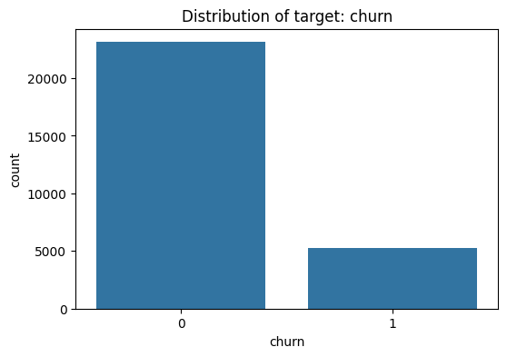

## 4. Correlation Heatmap
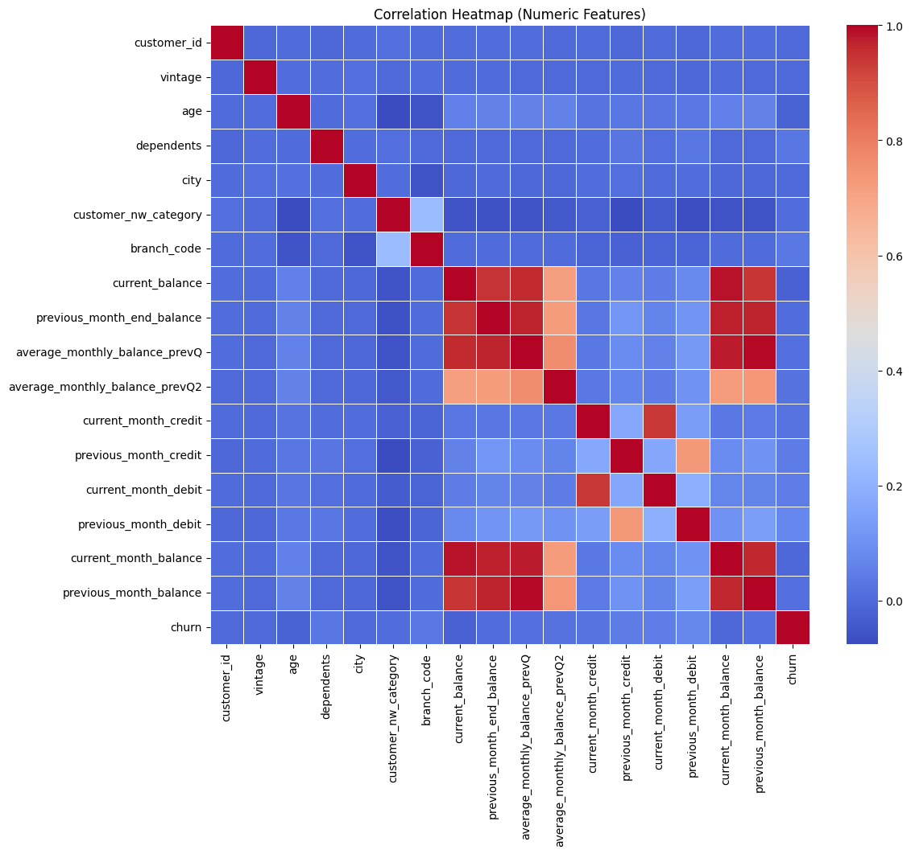

## 5. Univariate Numeric Distributions
### customer_id
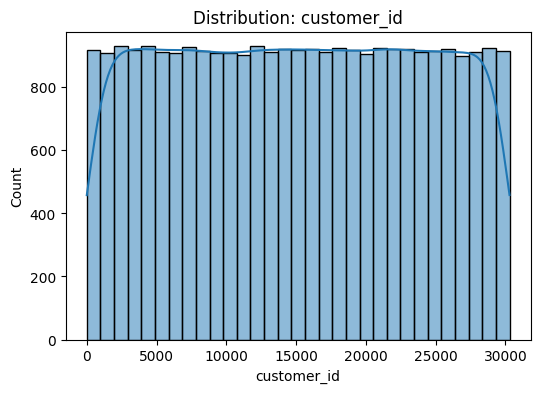

### vintage
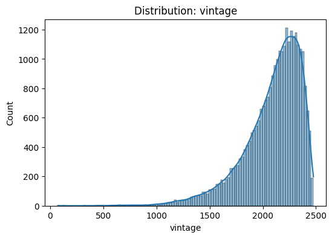

### age
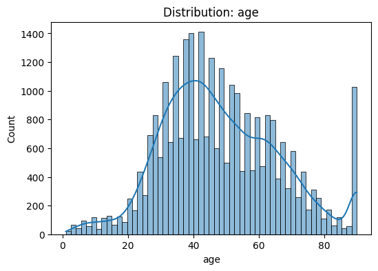

### dependents
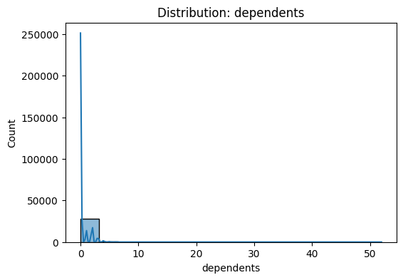

### city
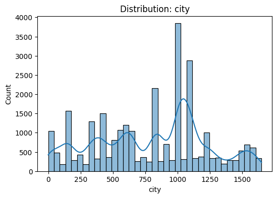

### customer_nw_category
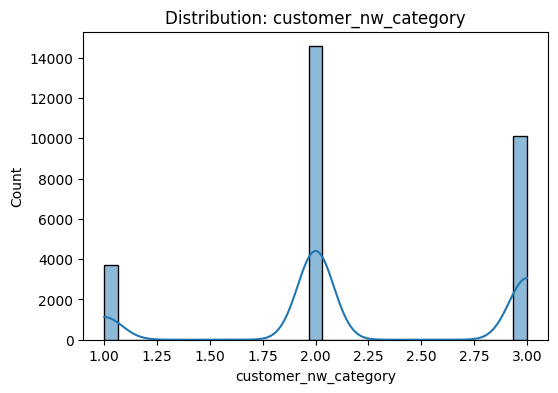

### branch_code
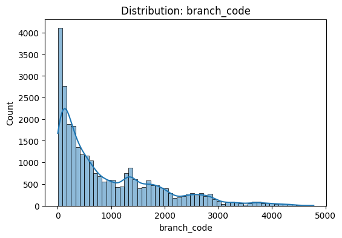

### current_balance
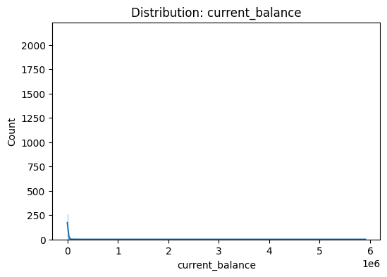

### previous_month_end_balance
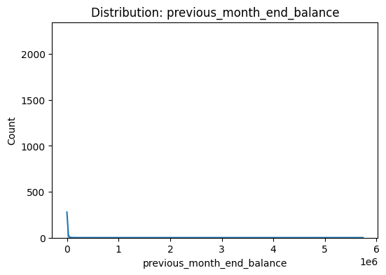

### average_monthly_balance_prevQ
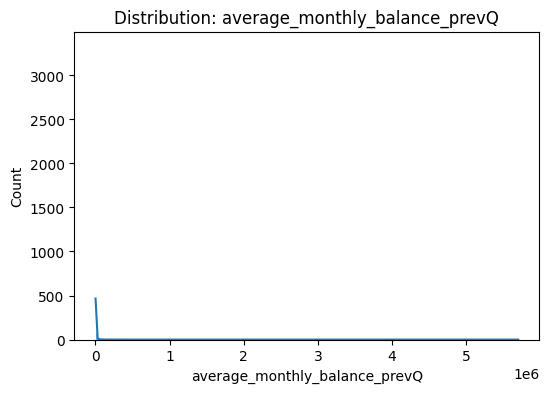

### average_monthly_balance_prevQ2
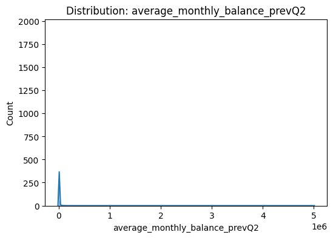

### current_month_credit
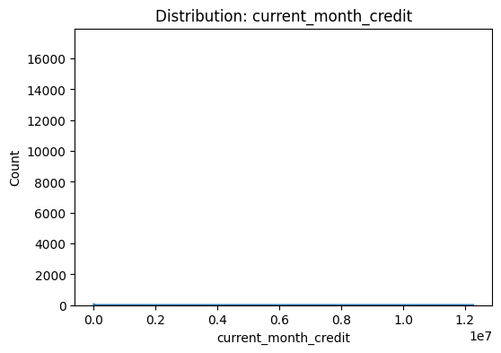

### previous_month_credit
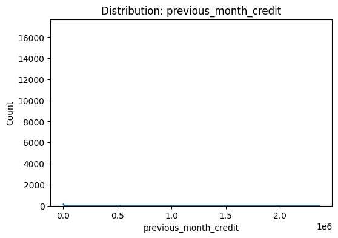

### current_month_debit
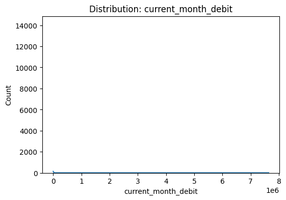

### previous_month_debit
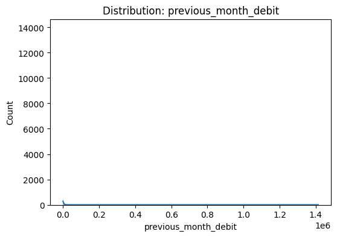

### current_month_balance
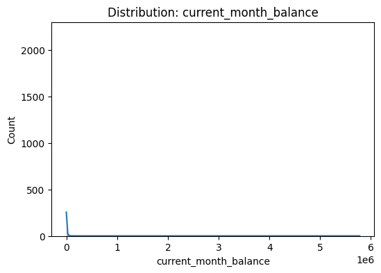

### previous_month_balance
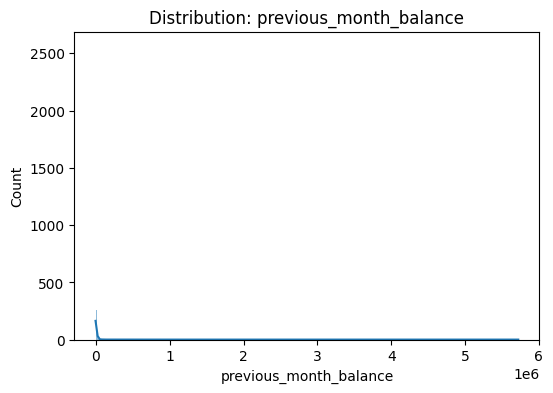

### churn
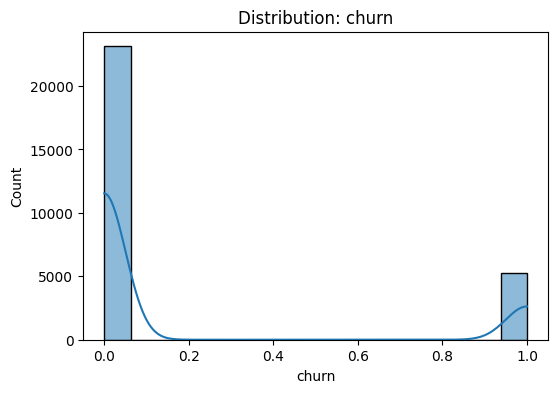

